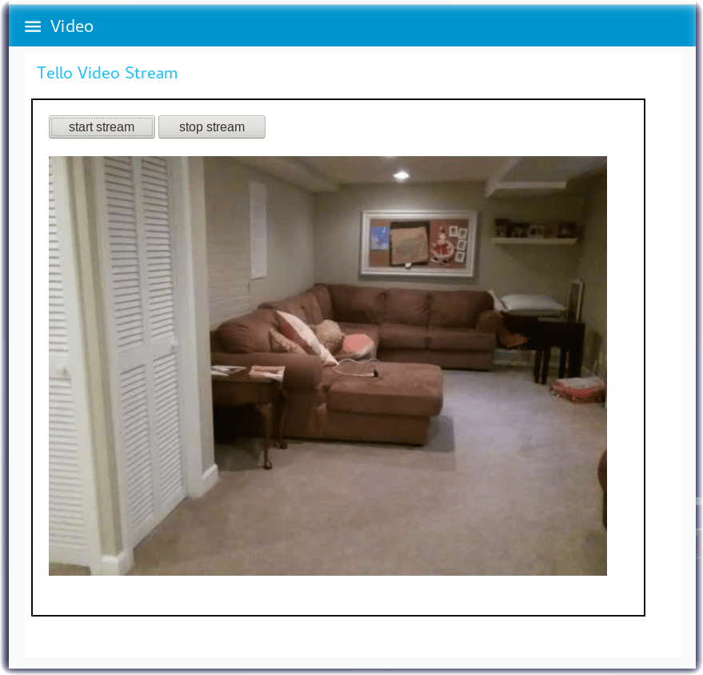
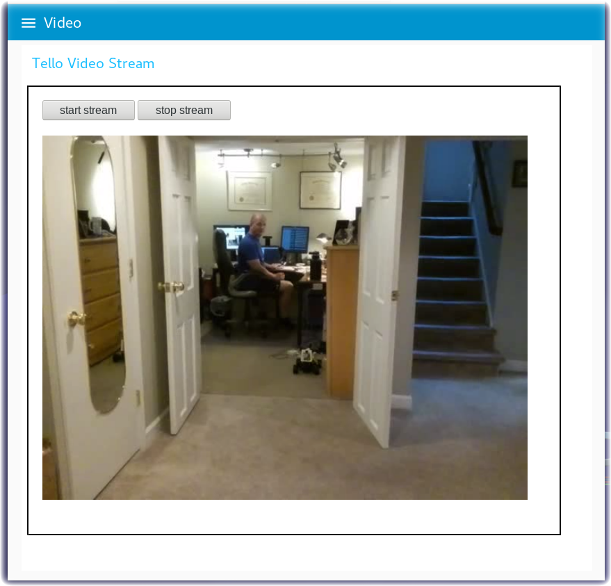
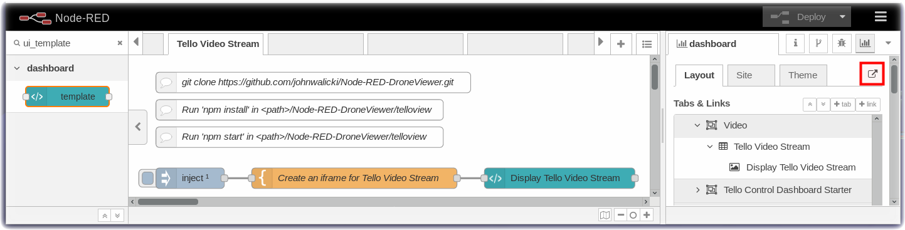
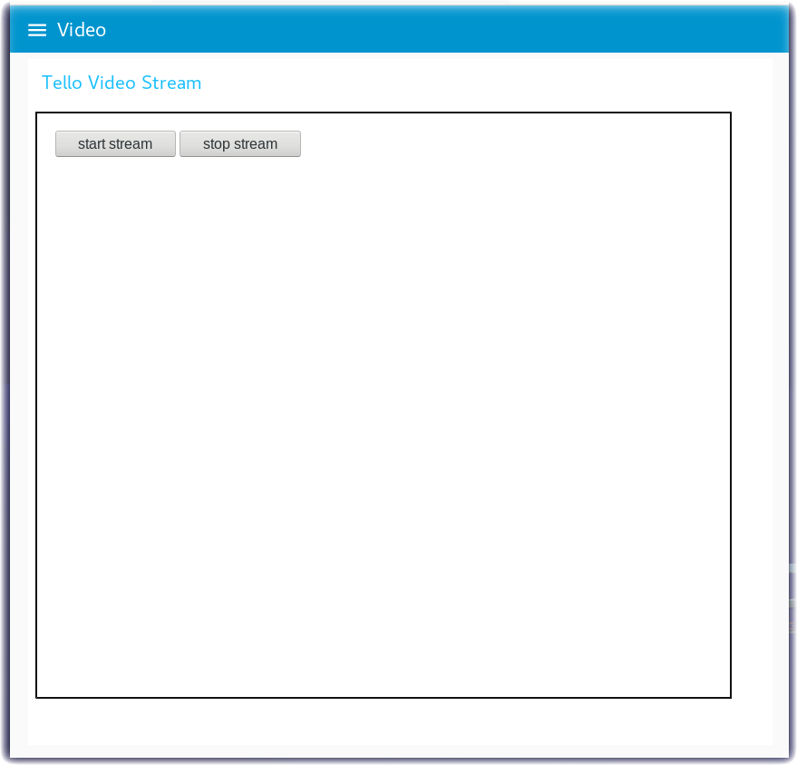

# Node-RED-DroneViewer

Node-RED flows to capture the video stream of the Ryze / DJI Tello Drone

This repository contains Node-RED flow examples that demonstrate how to capture the video stream from a [DJI Tello Drone](https://www.ryzerobotics.com/tello) using the [Node-RED visual editor](http://nodered.org).

## Introduction

Flying the Tello drone with the Android/iOS mobile apps is amazing fun but the Tello has another fantastic feature.
The Tello includes a programming interface that developers can use to send commands to control the drone. Programming
APIs can also receive telemetry and video stream data from the Tello. Ryze and DJI provide
[SDK programming documentation](https://www.ryzerobotics.com/tello/downloads) to help developers learn how to program
the drone.  Tello programming has grown so popular that they have released a [Tello EDU](https://www.ryzerobotics.com/tello-edu)
version that has additional [SDK documentation](https://www.ryzerobotics.com/tello-edu/downloads).
An entire open source community has formed around programming the Tello. If you are a developer, a good place to start is the
[TelloPilots](https://tellopilots.com/) forums. There are dozens of [github repositories](https://github.com/topics/tello)
that have programming examples written in [Python](https://github.com/damiafuentes/DJITelloPy),
[Go](https://github.com/SMerrony/tello), [Swift](https://github.com/tranchis/TelloSwift) and
[Node.js](https://github.com/SovGVD/nodetello).

This **Node-RED implementation** builds on the [Node-RED Tello Control](https://github.com/johnwalicki/Node-RED-Tello-Control) flows that [John Walicki](https://github.com/johnwalicki) previously published.

<table>
<tr>
<td></td>
<td></td>
</tr>
</table>

## How this git repository is organized

There are two programs that work together to this repository:

- [telloview](telloview/README.md) - Follow these instructions to set up and run a Node.js webserver to stream the video from the Tello.
- Node-RED flows that you can import into your Node-RED visual editor.

## Node-RED Steps

- [Install Node-RED](https://github.com/johnwalicki/Node-RED-Tello-Control/blob/master/docs/PART2.md)
- Import the Tello Videostream Starter flow into your Node-RED editor.
  - This initial [flow](flows/Node-RED-Tello-VideoStream-Starter.json) does not have any controls to fly the drone. The intent is to demonstrate capturing the video stream from the Tello before you fly it. You can hold the Tello and wave the camera around. If you want to fly and capture the stream you will need the Tello mobile app or other [Node-RED Tello Control Dashboards](https://github.com/johnwalicki/Node-RED-Tello-Control/blob/master/docs/PART4.md)
- Launch the Node-RED Dashboard by turning to the Dashboard tab in the right menu and then click on the launch button.
- Start the Tello Drone, connect to the Tello WiFi, and run the telloview video streaming node application.
- In the Node-RED Dashboard, click on the **start stream** button

<table>
<tr>
<td></td>
<td></td>
</tr>
</table>

As a reminder, **Safety First!**  Take caution when flying your drone. Fly your drone indoors at your own risk.
Also, be respectful of your neighbors and public property when flying your drone outdoors.  When recording video
and taking pictures, be mindful of other people's privacy.  Obey all FAA regulatory restrictions posted about UAV
flight prohibitions.

### Authors

- [John Walicki](https://github.com/johnwalicki/)
- [Va Barbosa](https://github.com/vabarbosa)
___

Enjoy!  Give us [feedback](https://github.com/johnwalicki/Node-RED-Tello-Control/issues) if you have suggestions on how to improve this tutorial.

## License

This tutorial is licensed under the Apache Software License, Version 2.  Separate third party code objects invoked within this code pattern are licensed by their respective providers pursuant to their own separate licenses. Contributions are subject to the [Developer Certificate of Origin, Version 1.1 (DCO)](https://developercertificate.org/) and the [Apache Software License, Version 2](http://www.apache.org/licenses/LICENSE-2.0.txt).

[Apache Software License (ASL) FAQ](http://www.apache.org/foundation/license-faq.html#WhatDoesItMEAN)
